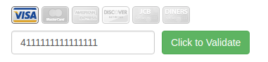

## TESTING
Github Pages: https://saunindm.github.io/ahj-homeworks-04/

### Credit Card Validator

#### Легенда

Вам пришла задача: сделать виджет, позволяющий вводить номер карты (можете в качестве общего развития почитать про PCI DSS).

Общий вид виджета должен выглядеть следующим образом:

Скриншот взят с сайта http://www.validcreditcardnumber.com.

Вам нужно провести исследовательскую работу и выяснить - на базе чего определяется, какой платёжной системе принадлежит определённая карта (не забудьте про "Мир").

#### Описание

Используйте [следующий алгоритм](https://en.wikipedia.org/wiki/Luhn_algorithm) для проверки валидности номера карты.

Изображения для карт необходимо найти самостоятельно (помните, про авторские права и недопустимость нелегального использования). Обычно информацию об использованных изображениях размещают в файле `licenses.txt` и кладут в корень сайта (настройте для этого соответствующим образом Webpack).

Разделите логику проверки номера карты, выяснения принадлежности определённой платёжной системе и взаимодействия с DOM.

Напишите авто-тесты на функции проверки номера карты и принадлежности определённой платёжной системе.

В качестве источника номеров карт используйте сервис [FreeFormatter](https://www.freeformatter.com/credit-card-number-generator-validator.html).

Подсказка

Для поиска изображений можете воспользоваться сервисом https://findicons.com**

---

### Puppeteer

Подключите Puppeteer и проверьте взаимодействие для двух различных вариантов:
1. Ввод валидного номера карты
1. Ввод невалидного номера краты

---

### JSDOM

К предыдущей задаче подключите JSDOM и реализуйте проверку с использованием `jest.each` (т.е. вам надо проверить взаимодействие с DOM).